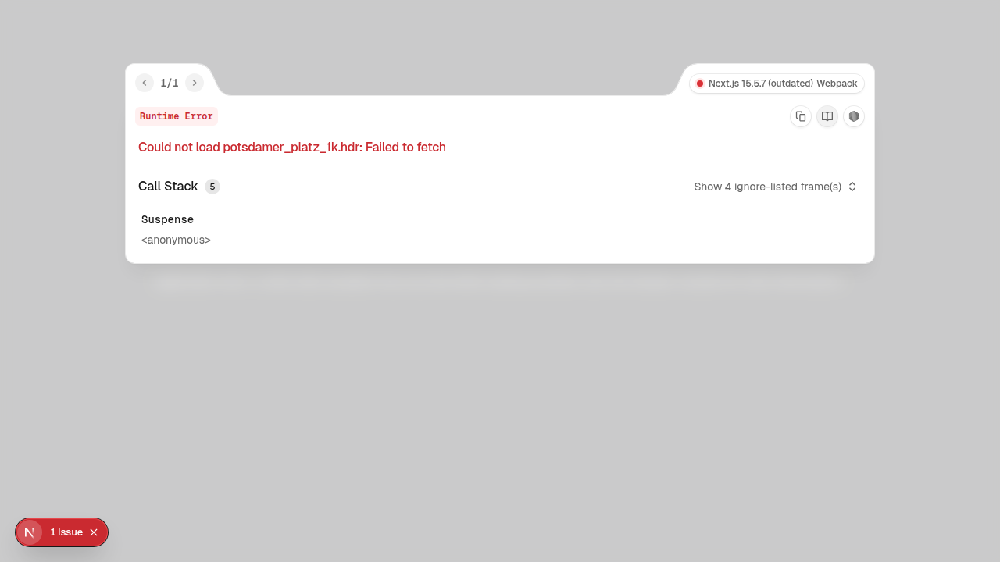

# ChainSpeed - "Ookla for Web3"

> **The Speedtest for blockchains.** Test and compare blockchain performance in real-time.

## 📋 Project Overview

**Project Name:** ChainSpeed

**Tagline:** Ookla Speedtest, but for Web3 — benchmark and compare blockchain networks instantly.

**Description:**
ChainSpeed is a web-based blockchain performance testing tool that enables users to compare different blockchain networks (Polkadot and Stellar) in real-time. Just like Ookla's Speedtest measures your internet speed, ChainSpeed measures blockchain speed, latency, throughput, and finality. It provides both generic cross-chain metrics and chain-specific insights, helping developers and users make informed decisions about which blockchain fits their needs.

## 👥 Team Information

**Team Name:** ChainSpeed

**Team Members:**
- [Maheen](https://github.com/MachoMaheen) - Full Stack Developer
- [Surya](https://github.com/SuryaS2125) - Full Stack Developer

## 🛠️ Technologies Used

- **Frontend:** Next.js 15, React 19, TypeScript, Tailwind CSS, Framer Motion, Three.js (React Three Fiber)
- **Backend:** Node.js, Express, Socket.io
- **Blockchain:** 
  - Polkadot (@polkadot/api)
  - Stellar (@stellar/stellar-sdk)
- **Monorepo:** npm workspaces
- **Real-time:** WebSocket for live test progress streaming

## 🏗️ Architecture

```
chainspeed/
├── apps/
│   ├── web/           # Next.js frontend with 3D visualizations
│   └── api/           # Express + Socket.io backend
├── packages/
│   └── shared/        # Shared types and scoring algorithms
├── package.json       # Workspace root
└── README.md
```

**Flow:**
1. User clicks "GO" button
2. Backend initiates parallel tests against Polkadot and Stellar networks
3. Real-time progress streams via WebSocket
4. Results calculated with normalized 0-100 scoring
5. Winner determined and displayed with celebration UI

## 🚀 Getting Started

### Prerequisites

- Node.js 20+
- npm 10+

### Installation

```bash
# Install dependencies
npm install

# Start development servers (runs both API and web)
npm run dev
```

Or run separately:

```bash
# Terminal 1: Start API server
npm run dev:api

# Terminal 2: Start web frontend
npm run dev:web
```

### Configuration

```bash
cp .env.example .env
# Edit .env with your RPC endpoints if needed
```

### Running the Project

```bash
# Development
npm run dev

# Access
# Frontend: http://localhost:3000
# API: http://localhost:3001
```

## 📱 Features

- [x] **One-Click Testing** - Just click GO, like Speedtest.net
- [x] **Dual Test Modes**
  - Network Benchmark: Compare Polkadot vs Stellar performance
  - Node Diagnostic: Test your own RPC/node
- [x] **Generic + Specific Metrics**
  - Universal: Latency, Throughput, Finality, Reliability
  - Polkadot: XCM, GRANDPA, Validators, Parachains
  - Stellar: Soroban, Path Payments, Ledger Close
- [x] **Real-Time Results** - WebSocket streaming progress with 3D visualization
- [x] **Winner Determination** - Normalized 0-100 scoring system
- [x] **Beautiful UI** - Dark theme, glassmorphism, animated gradients, 3D cards

## 🎯 Use Cases

1. **Developers** - Compare blockchain performance before choosing a platform
2. **Node Operators** - Benchmark their RPC endpoints against public nodes
3. **Researchers** - Collect performance data across different networks
4. **Users** - Understand which blockchain offers better speed for their use case

## 🔗 Links & Resources

- **Live Demo:** [https://chainspeed-web.vercel.app](https://chainspeed-web.vercel.app)
- **Video Demo:** [Coming Soon]

## 📸 Screenshots

### Home Page - Initial State


*The ChainSpeed application home screen*

### Application Features

The ChainSpeed application includes:
- 🎨 **Animated gradient background** with particle effects
- 🎴 **3D HoloCards** displaying test results with React Three Fiber
- 📊 **Real-time progress visualization** with WebSocket streaming
- 🎉 **Winner celebration** with confetti animation
- ⚡ **Interactive blockchain performance comparison** between Polkadot and Stellar
- 🎯 **Dual test modes**: Network Benchmark and Node Diagnostic

*For additional screenshots showing test results, 3D visualizations, and winner celebrations, please visit the [live demo](https://chainspeed-web.vercel.app).*

## 📊 Metrics Explained

### Generic Metrics (0-100 scored)

| Metric | Description | Scoring |
|--------|-------------|---------|
| Latency | RPC response time | <50ms = 95-100 |
| Throughput | Transactions per second | >100 TPS = 70+ |
| Finality | Time to finality | <6s = 85+ |
| Reliability | Error rate | <0.1% = 99+ |

### Chain-Specific Metrics

**Polkadot:**
- XCM Success Rate
- GRANDPA Finality Lag
- Active Validators
- Parachain Count

**Stellar:**
- Ledger Close Time
- Soroban Invocations
- Path Payment Success
- Ledger Close Variance

## 🚧 Challenges & Solutions

1. **Real-time Updates** - Implemented WebSocket for live progress streaming instead of polling
2. **Cross-chain Comparison** - Created normalized scoring (0-100) to fairly compare different metrics
3. **Performance** - Used React Three Fiber for GPU-accelerated 3D visualizations

## 🔮 Future Improvements

- [ ] Add more blockchain networks (Ethereum, Solana, etc.)
- [ ] Historical performance tracking and graphs
- [ ] Geographic distribution testing
- [ ] Community leaderboard for nodes
- [ ] Mobile app version

## 📄 License

MIT

## 🙏 Acknowledgments

- Polkadot and Stellar teams for their excellent SDKs
- React Three Fiber for 3D capabilities
- Framer Motion for smooth animations

---

**Built for Stellar x Polkadot Hackerhouse BLR** 🎉
